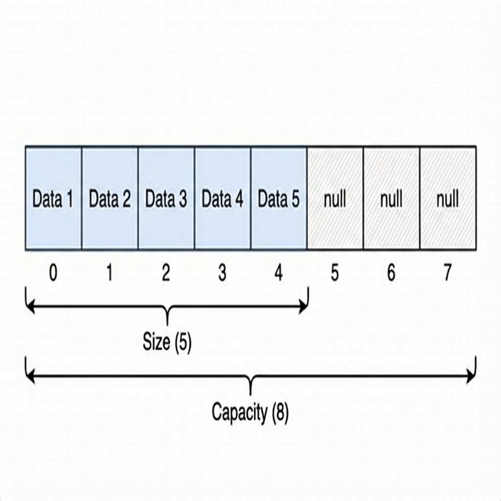

# ArrayList Implementation

## 1. Function of ArrayList

An **ArrayList** is a resizable array implementation of the `List` interface. It provides a way to store an ordered collection of elements with dynamic resizing capabilities.

*   **Random Access**: It is backed by an array, allowing `O(1)` access to any element via its index.
*   **Dynamic Resizing**: Unlike standard Java arrays, an ArrayList grows automatically when elements are added beyond its current capacity.
*   **Ordered**: It maintains the insertion order of elements.



## 2. Concerns when Developing an ArrayList

Developing a robust ArrayList involves addressing several key concerns regarding memory and performance:

| Concern Target | Issue Description | Proposed Solution |
| :--- | :--- | :--- |
| **Fixed Size Arrays** | Native arrays in Java have a fixed size once allocated. | **Dynamic Expansion**: When full, create a new, larger array and copy all elements over. |
| **Expansion Cost** | Allocating specific memory and copying elements is an `O(N)` operation. | **Amortized Analysis**: Expand by a growth factor (e.g., 1.5x) rather than +1. This ensures that `N` insertions take `O(N)` total time, averaging `O(1)` per insertion. |
| **Shifting Overhead** | Inserting or removing elements in the middle requires moving subsequent elements. | **Array Copy**: Use efficient native methods like `System.arraycopy` to shift blocks of memory. |
| **Generics** | Java arrays are covariant and reified, while Generics are erased. `new T[size]` is illegal. | **Object Array**: Back the list with an `Object[]` and cast to `(T)` (or `(S)`) when retrieving elements. |

### Deep Dive: System.arraycopy

`System.arraycopy` is a native method in Java used for efficient array manipulation. Unlike a manual `for-loop`, it uses low-level memory copy operations (like `memmove` in C), making it significantly faster for large arrays and handling updates atomically where possible.

**Signature:**
```java
public static native void arraycopy(Object src,  int  srcPos,
                                    Object dest, int destPos,
                                    int length);
```

**Usage in ArrayList:**
It is the engine behind dynamic resizing and element shifting.

*   **Shifting for Insert**: To insert at index `i`, we shift elements from `i` to the end one position to the *right* to make space.
    ```java
    // move elements starting at 'index' to 'index + 1'
    System.arraycopy(list, index, list, index + 1, size - index);
    ```

*   **Shifting for Remove**: To remove at index `i`, we shift elements from `i+1` to the end one position to the *left* to fill the gap.
    ```java
    // move elements starting at 'index + 1' to 'index'
    System.arraycopy(list, index + 1, list, index, size - index);
    ```

## 3. Concerns when Using an ArrayList

Users of an ArrayList must be aware of its performance characteristics:

| Concern | Risk | Best Practice |
| :--- | :--- | :--- |
| **Frequent Resizing** | Adding many elements to a default list causes multiple O(N) copy operations. | **Initial Capacity**: If you know the approximate size, initialize with `new MyArrayList(capacity)` to avoid intermediate resizes. |
| **Middle Insertability** | `add(0, item)` or `remove(0)` forces a shift of the entire array (`O(N)`). | Use `LinkedList` if you frequently manipulate the head/middle of the list. Use `ArrayList` for tail operations. |
| **Thread Safety** | Not thread-safe. Concurrent modifications during iteration cause undefined behavior. | Use `CopyOnWriteArrayList` or `Collections.synchronizedList`. |

## 4. Limitations of ArrayList

1.  **Slow Insertions/Deletions**: Inserting or deleting elements at arbitrary positions (other than the end) is `O(N)` because it requires shifting.
2.  **Memory Overhead**: The capacity is often larger than the actual size (to allow for growth), resulting in unused memory slots.
3.  **Contiguous Memory**: Requires a large block of contiguous memory, which might be harder to allocate than linked nodes for extremely large datasets.

## 5. Evolutionary Logic of Developing an ArrayList

**Step 1: The Goal**
*   **Requirement**: A list that behaves like an array (fast access) but has no size limit.
*   **Initial Approach**: Use a standard array `Object[]`.

**Step 2: Handling Growth**
*   **Problem**: We fill the array.
*   **Solution**: `expand()`. Allocate a new array with `size * 1.5`.
*   **Mechanism**: `Arrays.copyOf` or `System.arraycopy`.

**Step 3: Handling Deletions**
*   **Problem**: Removing an item leaves a "hole" (null) in the middle.
*   **Solution**: Shift all subsequent elements one step to the left to close the gap.
*   **Mechanism**: `System.arraycopy(list, index + 1, list, index, size - index)`.

**Step 4: Optimization**
*   **Problem**: Frequent `add` calls trigger frequent resizes if capacity increases by 1 each time.
*   **Solution**: **Exponential Growth**. By increasing capacity by a percentage (50%), we ensure that resizing happens logarithmically fewer times as the list grows.
