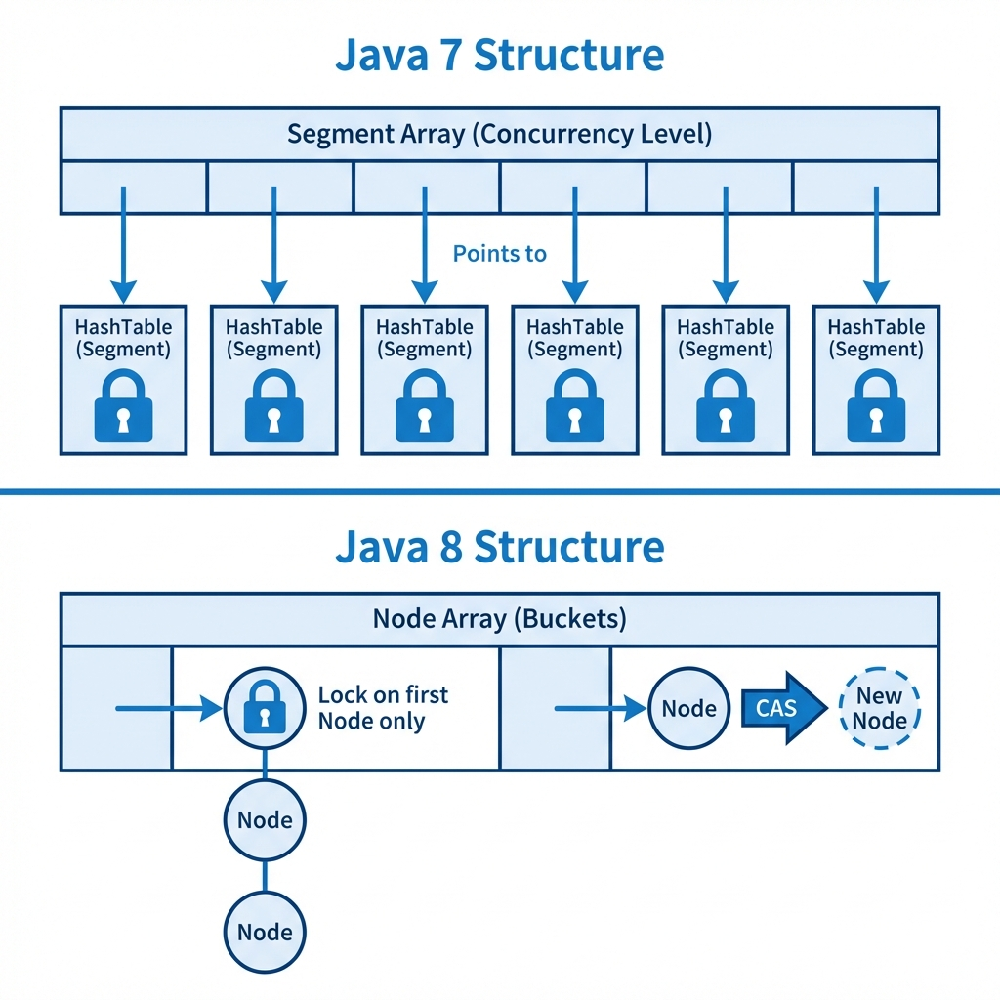
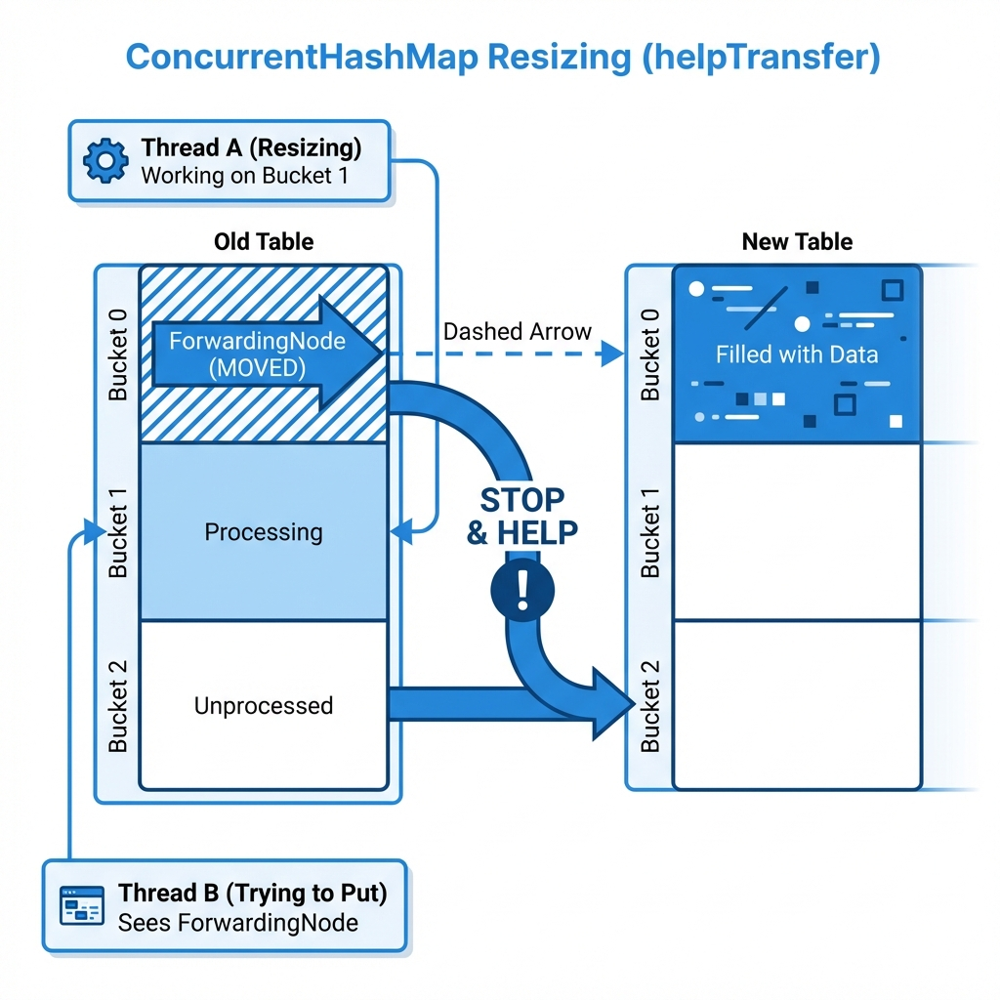

# ConcurrentHashMap Implementation

## 1. Function of ConcurrentHashMap

A **ConcurrentHashMap** is a thread-safe implementation of the `Map` interface. It provides high concurrency for both read and write operations without blocking the entire map.

*   **Thread Safety**: Safe for use by multiple threads concurrently.
*   **High Concurrency**: updates are optimized to minimize contention (unlike `Hashtable` or `Collections.synchronizedMap` which lock the entire map). Retrievals do not block updates and often do not block other retrievals.
*   **No Nulls**: Unlike `HashMap`, it does **not** allow `null` to be used as a key or a value.
*   **Weakly Consistent Iterators**: Iterators reflect the state of the map at some point at or since the creation of the iterator. They do *not* throw `ConcurrentModificationException`.



## 2. Concerns when Developing a ConcurrentHashMap

Developing a highly concurrent map is complex and involves managing thread contention.

| Concern Target | Issue Description | Proposed Solution |
| :--- | :--- | :--- |
| **Contention** | Multiple threads trying to write to the map can cause bottlenecks if a single lock is used. | **Lock Stripping / CAS**: Use fine-grained locking. In Java 7, this was "Segments" (locks on parts of the array). In Java 8+, it uses **CAS (Compare-And-Swap)** for insertion into empty bins and `synchronized` locks only on the head node of a specific bin during collision. |
| **Resizing** | Resizing an array while other threads are reading/writing is dangerous. | **Concurrent Resizing**: Allow multiple threads to "help" transfer elements from the old table to the new table. |
| **Visibility** | Changes made by one thread must be visible to others. | **Volatile Variables**: Use `volatile` for references to table nodes and value fields to ensure `happens-before` relationships. |

## 3. Concerns when Using a ConcurrentHashMap

| Concern | Risk | Best Practice |
| :--- | :--- | :--- |
| **Null Keys/Values** | Trying to insert `null` throws `NullPointerException`. | Ensure data checks before insertion. Use `Optional` or specific sentinel values if "absence" needs to be stored. |
| **Composite Atomicity** | calling `get` then `put` is not atomic even if both methods are thread-safe individually. | Use atomic methods provided by the class: `putIfAbsent`, `computeIfAbsent`, `replace`, `remove(key, value)`. |
| **Size Accuracy** | `size()` might not be exact if concurrent modifications are happening. | Treat `size()` as an estimate in high-concurrency contexts. |

## 4. Limitations of ConcurrentHashMap

1.  **Complexity**: Significantly more complex to implement than `HashMap`.
2.  **Memory Overhead**: Can have slightly higher memory overhead per node due to internal structures required for synchronization or treeification.
3.  **No Nulls**: Strict requirement for non-null keys and values.

## 5. Evolutionary Logic

**Step 1: The Requirement**
*   Need a Map that supports high throughput in multi-threaded applications.
*   `Hashtable` (single lock) is too slow under contention.

**Step 2: Lock Stripping (Java 7 approach)**
*   Divide the hash table into N "Segments".
*   Each segment acts like a mini-Hashtable with its own lock.
*   Threads accessing different segments don't contend.

**Step 3: Fine-Grained Locking & CAS (Java 8+ approach)**
*   Abandon Segments (mostly).
*   Treat the table as a single array of Nodes.
*   **Read**: No locking (volatile reads).
*   **Write (Empty Bin)**: Use **CAS** to insert the first node. fast and lock-free.
*   **Write (Collision)**: Lock **only the head node** of that specific bucket using `synchronized`.
*   **Treeification**: Convert long linked lists to Red-Black Trees (similar to HashMap) for performance, with special `TreeBin` locks.

## 6. Locking Evolution: Java 7 vs Java 8

The implementation of `ConcurrentHashMap` underwent a massive overhaul in Java 8. The move from **Segments** to **CAS + Synchronized** was driven by performance and memory efficiency.

### Java 7: The Segment Era
*   **Structure**: The map was divided into a fixed number of "Segments" (default 16).
*   **Locking**: Each Segment extended `ReentrantLock`.
*   **Constraint**: The "concurrency level" was fixed at instantiation. If you had 16 segments but 100 threads, significant contention would occur on those 16 locks.
*   **Memory**: High overhead. Even an empty map had to instantiate the Segment array and the Segments themselves.

### Java 8: The CAS Era
*   **Structure**: A single Node array, similar to `HashMap`.
*   **Locking**:
    1.  **No Lock (CAS)**: If a bucket is empty, a thread attempts to insert the new node using `Unsafe.compareAndSwapObject`. This is a hardware-level atomic operation that requires no OS mutex.
    2.  **Synchronized**: If a bucket is non-empty (collision), the thread synchronizes on the **first node** (head) of that bucket.
*   **Benefit**:
    *   **Micro-Granularity**: Contention is limited to a *single hash bucket*.
    *   **Dynamic Scaling**: The number of "locks" implicitly scales as the map resizes, rather than being fixed at start.
    *   **Memory**: No extra Segment objects. Structure is almost identical to a standard `HashMap`.

## 7. Comparison: HashMap vs ConcurrentHashMap (Java 8+)

| Feature | HashMap | ConcurrentHashMap |
| :--- | :--- | :--- |
| **Thread Safety** | **Not Thread-Safe**. Requires external synchronization. | **Thread-Safe**. Internal fine-grained locking. |
| **Locking Mechanism** | **None**. | **CAS** (for empty bins) + **synchronized** (on bin head for collisions). |
| **Null Keys/Values** | **Allowed** (1 null key, many null values). | **Not Allowed**. Throws `NullPointerException`. |
| **Read Operations** | fast, but unsafe in concurrency. Concurrent reads/writes can cause infinite loops or corrupted data. | **Wait-Free**. Reads generally do not block and do not require locks. |
| **Write Operations** | fast, but unsafe in concurrency. | **Thread-Safe**. Atomic operations. uses `CAS` for fast path, `synchronized` for slow path. |
| **Iterators** | **Fail-Fast**. Throws `ConcurrentModificationException` if modified during iteration. | **Weakly Consistent**. Does *not* throw exception. Reflects state at some point during iteration. |
| **Implementation** | Simple Array of Buckets. | Array of Buckets + `volatile` checks + CAS + `TreeBin` locks. |

## 8. Deep Dive: Locking in Action (Pseudo-Code)

To visualize how `put(key, value)` avoids locking the whole map, here is the simplified logic from Java 8's implementation.

**Key Concepts**:
1.  **`tabAt` / `casTabAt`**: Hardware-level atomic operations (Unsafe).
2.  **`synchronized(f)`**: Only locks the **head** node of a specific bucket.

```java
final V putVal(K key, V value, boolean onlyIfAbsent) {
    int hash = spread(key.hashCode()); // Scramble bits
    for (Node<K,V>[] tab = table;;) {
        Node<K,V> f; int n, i, fh;
        
        // CASE 1: Table is not initialized yet
        if (tab == null || (n = tab.length) == 0)
            tab = initTable(); // Implementation uses CAS to ensure only 1 thread inits
        
        // CASE 2: The calculated bucket index is EMPTY
        // We calculate index 'i' and check if table[i] is null ("volatile read")
        else if ((f = tabAt(tab, i = (n - 1) & hash)) == null) {
            // TRY TO CAS (Compare-And-Swap)
            // If table[i] is still null, replace it with new Node(key, value).
            // This is non-blocking! If it fails (another thread beat us), 
            // the loop restarts.
            if (casTabAt(tab, i, null, new Node<K,V>(hash, key, value, null)))
                break;                   
        }
        
        // CASE 3: Resizing is currently happening (Node is a special "ForwardingNode")
        // We help the other threads move data to the new table.
        else if ((fh = f.hash) == MOVED)
            tab = helpTransfer(tab, f);
        
        // CASE 4: Bucket Collision (Actual Locking)
        else {
            V oldVal = null;
            // LOCK ONLY THIS NODE 'f' (Head of the chain)
            synchronized (f) {
                // Double-check that 'f' is still the head of the bucket
                if (tabAt(tab, i) == f) {
                    // Traverse chain and update/append...
                    // This block is the ONLY time we strictly block other threads
                    // attempting to write to THIS specific bucket.
                }
            }
            // After lock release, check if we need to turn this list into a Tree
            if (binCount >= TREEIFY_THRESHOLD)
                treeifyBin(tab, i);
            if (oldVal != null) return oldVal;
            break;
        }
    }
    addCount(1L, binCount); // Update size (internally complex to avoid contention)
    return null;
}
```

## 9. Deep Dive: Concurrent Resizing (helpTransfer)

One of the most innovative features of `ConcurrentHashMap` is that resizing is not a "stop-the-world" event. Instead, multiple threads collaborate to resize the map.

### The Problem
In a standard `HashMap`, if Thread A triggers a resize, it must copy all elements to a new array. If Thread B tries to write during this time, it must either block or risk data corruption.

### The Solution: ForwardingNodes
When `ConcurrentHashMap` begins resizing:
1.  It creates a `nextTable` (double the size).
2.  It processes the old table one bucket at a time.
3.  Once a bucket (e.g., index `i`) is fully copied to the `nextTable`, it places a special **ForwardingNode** in `table[i]`.
    *   **Hash**: `MOVED` (-1)
    *   **Content**: A reference to `nextTable`.

### The Logic flow
When a thread calls `put(key, value)`:
1.  It hashes the key and looks at the bucket.
2.  **Is it a ForwardingNode?**
    *   **YES**: "Oh, a resize is happening, and this bucket is already moved."
    *   **Action**: call `helpTransfer(tab, f)`. The thread **pauses its own operation** and offers its CPU cycles to transfer *other* buckets from the old table to the new table.
    *   **NO**: Proceed with standard insertion logic (CAS or Synchronized).


