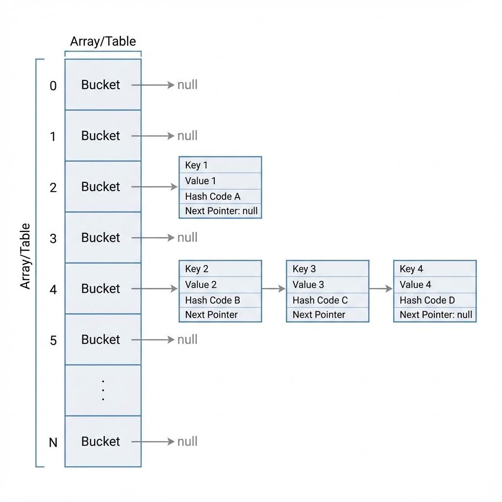
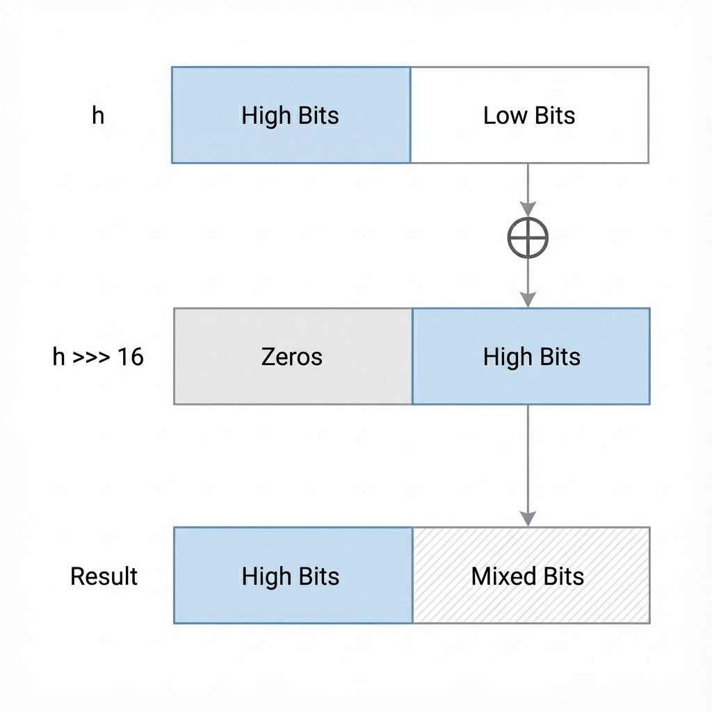

# HashMap Implementation

## 1. Function of HashMap

A **HashMap** is a data structure designed to store data in key-value pairs. It provides an efficient way to insert, delete, and retrieve data based on keys.

*   **Key-Value Mapping**: Each element is stored as a `Entry<K, V>` object, where `K` is the key and `V` is the value.
*   **Fast Access**: It uses a **hashing technique** to compute an index into an array of buckets or slots, from which the desired value can be found. Ideally, this results in O(1) time complexity for basic operations (get and put).
*   **Unordered**: It makes no guarantees as to the order of the map; in particular, it does not guarantee that the order will remain constant over time.



## 2. Concerns when Developing a HashMap

Developing a robust HashMap involves addressing several key concerns:

| Concern Target | Issue Description | Proposed Solution |
| :--- | :--- | :--- |
| **Collisions** | Different keys may generate the same hash code or map to the same bucket index. | **Chaining**: Use a linked list (or balanced tree) at each bucket.<br>**Open Addressing**: Probe for another slot (Linear/Quadratic). |
| **Hash Distribution** | Poor hash functions cause keys to clump in a few buckets, degrading performance to O(n). | **Good Hash Function**: Spread keys uniformly.<br>**Rehashing**: Apply bit-mixing (e.g., `h ^ (h >>> 16)`) to randomize bits. |
| **Load Factor** | As elements increase, collision chance rises. | **Dynamic Resizing**: Double array capacity when Load Factor > 0.75 and rehash entries. |
| **Concurrency** | Not thread-safe; concurrent modification causes data corruption or loops. | **External Sync**: `Collections.synchronizedMap`.<br>**Concurrent Map**: `ConcurrentHashMap`. |

### Deep Dive: Why `h >>> 16`?
The bit-mixing formula `h ^ (h >>> 16)` is specific to **32-bit integers**.
*   **Goal**: To prevent "tunnel vision" where only the lower bits of the hash determine the bucket index (due to masking).
*   **Why 16?**: 16 is exactly half of 32. Shifting by 16 moves the entire "Top Half" of the bits over the "Bottom Half".
*   **Result**: By XORing them, the high-order bits influence the low-order bits, drastically reducing collisions for sequential keys or keys that only differ in their upper bits.



## 3. Concerns when Using a HashMap

While the previous section covered *internal* development concerns, users of a HashMap must also be aware of the following to ensure correctness:

| Concern | Risk | Best Practice |
| :--- | :--- | :--- |
| **Mutable Keys** | Modifying a key after insertion changes its hash code, making the entry irretrievable (memory leak). | Always use **immutable objects** (e.g., `String`, `Integer`) as keys. |
| **`equals()` & `hashCode()`** | Objects that are logically equal but have different hash codes will be treated as different keys. | If you override `equals()`, you **must** override `hashCode()`. |
| **Iteration Order** | Order of keys/values can change after resizing (rehashing). | Use `LinkedHashMap` for insertion order or `TreeMap` for sorted order. |

## 4. Limitations of HashMap

1.  **No Ordering**: It does not maintain the insertion order of elements (unlike `LinkedHashMap`) nor does it sort keys (unlike `TreeMap`).
2.  **Thread Safety**: It is not thread-safe by default.
3.  **Memory Overhead**: It requires more memory than a simple list or array due to the storage of Entry objects (nodes), pointers for linked lists, and the empty slots in the bucket array (to maintain a low load factor).
4.  **Performance degradation on potential bad keys**: If many keys define a poor `hashCode()`, performance drops significantly.

## 5. Evolutionary Logic of Developing a HashMap

This section illustrates the logical progression of solving problems during the development of a HashMap.

**Step 1: The Goal**
*   **Requirement**: We need a data structure that maps a Key to a Value and allows retrieval in `O(1)` time.
*   **Initial Approach**: Use an array.
*   **Problem**: Arrays only accept *integers* as indices. We have complex objects as keys.

**Step 2: Hashing Strategy**
*   **Solution**: Convert the Object Key into an Integer using a hash function (`hashCode()`).
*   **Mechanism**: Use `key.hashCode() % arrayLength` to calculate the index.
*   **New Problem (Collisions)**: Two completely different keys might produce the same index.

**Step 3: Handling Collisions**
*   **Solution**: Don't just store the value in the array. Store a **Entry/Node** object that contains the Key, Value, and a pointer to the **Next** node.
*   **Result**: Each array slot (bin) becomes a **Linked List**.
*   **New Problem**: If a specific bin gets too populated (due to poor hashing or DDoS attacks), retrieval slows down to `O(n)` (linear time).

**Step 4: Performance Optimization (Treeification)**
*   **Solution**: When a single bin exceeds a threshold (e.g., 8 items), stop using a Linked List.
*   **Transformation**: Convert that specific bin into a **Red-Black Tree**.
*   **Result**: Worst-case performance improves from `O(n)` to `O(log n)`.

**Step 5: Scaling (Resizing)**
*   **Problem**: As we add more items, collisions become inevitable purely due to lack of space.
*   **Solution**: Track the **Load Factor** (Size / Capacity). If it exceeds ~0.75, create a new array with **double** the capacity.
*   **Cost**: We must "rehash" and move every existing item to the new array.

**Step 6: Efficient Math (Powers of Two)**
*   **Optimization**: Calculating `hash % length` (modulo) is slow for CPUs.
*   **Solution**: Force the array capacity to always be a **Power of Two** (16, 32, 64...).
*   **Benefit 1**: We can replace modulo with bitwise AND: `hash & (capacity - 1)`.
*   **Benefit 2**: When resizing, items either stay at the same index or move to `index + oldCapacity`, making the resize operational very efficient.


## 6. Red-Black Tree Rotations

Rotations are fundamental operations used to maintain the balance of the Red-Black tree during insertion and deletion. They change the local structure of the tree without violating the binary search tree ordering property.

### Rotate Left

A Left Rotation effectively "moves" the parent node down to the left and promotes the right child to be the new parent.

**Scenario**: Node `P` (Parent) has a Right Child `R`. We want to rotate left at `P`.

```text
      [GP]  <-- GrandParent (optional)
        |
       (P)  <-- Pivot Point
      /   \
     a    (R)
          /  \
         b    c
```

**Operation**: `rotateLeft(P)`

1.  `R` becomes the new root of this subtree.
2.  `P` becomes the **left** child of `R`.
3.  `R`'s original left child (`b`) is handed over to be `P`'s **right** child (since `b` > `P` but `b` < `R`).

**Result**:

```text
      [GP]
        |
       (R)
      /   \
    (P)    c
   /   \
  a     b
```

### Rotate Right

A Right Rotation effectively "moves" the parent node down to the right and promotes the left child to be the new parent.

**Scenario**: Node `P` (Parent) has a Left Child `L`. We want to rotate right at `P`.

```text
       [GP]
         |
        (P)  <-- Pivot Point
       /   \
     (L)    c
     / \
    a   b
```

**Operation**: `rotateRight(P)`

1.  `L` becomes the new root of this subtree.
2.  `P` becomes the **right** child of `L`.
3.  `L`'s original right child (`b`) is handed over to be `P`'s **left** child (since `b` < `P` but `b` > `L`).

**Result**:

```text
       [GP]
         |
        (L)
       /   \
      a    (P)
           /  \
          b    c
```
