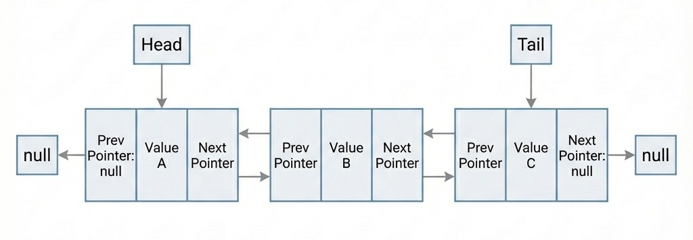

# LinkedList Implementation

## 1. Function of LinkedList

A **LinkedList** is a linear data structure where elements are not stored in contiguous memory locations. Instead, each element is a separate object (Node) that contains a reference (link) to the next element in the list.

*   **Doubly Linked**: This implementation maintains links to both the **previous** and **next** nodes, allowing traversal in both directions.
*   **Dynamic Structure**: Nodes can be added or removed easily without allocating a new large block of memory.
*   **Sequential Access**: Accessing an element by index requires traversing from the start (or end) of the list.




## 2. Concerns when Developing a LinkedList

Developing a LinkedList involves handling pointers and memory management effectively:

| Concern Target | Issue Description | Proposed Solution |
| :--- | :--- | :--- |
| **Random Access** | Elements are scattered in heap memory. | **Traversal Optimization**: To `get(index)`, traverse from the `head` if index is in the first half, or from the `tail` if in the second half. |
| **Memory Overhead** | Each element requires a wrapper object (`Node`) with extra references. | **Assessment**: Accept the overhead (2 references + 1 object header per element) as the trade-off for efficient insertions/deletions. |
| **Tail Operations** | Adding to the end is O(N) if we only have a `head` reference. | **Tail Pointer**: Maintain a `lastNode` reference to allow O(1) appending to the list. |
| **Generics** | Storing various types safely. | **Generic Class**: Use `MyLinkedList<S>` to ensure type safety without casting. |

### Deep Dive: Doubly Linked Structure

By keeping track of both `prev` and `next`, we gain flexibility at the cost of slight memory increase.

**Node Structure:**
```java
public static class Node<S> {
    public S value;
    public Node<S> prev;
    public Node<S> next;
    // ...
}
```

**Optimization for `get(int index)`:**
Instead of always starting from the `firstNode`, we check if the requested index is closer to the beginning or the end. This halves the worst-case traversal time.

```java
if (index < (size >> 1)) { // if index is in the lower half
    return getFromHead(index);
}
return getFromTail(index);
```

## 3. Concerns when Using a LinkedList

| Concern | Risk | Best Practice |
| :--- | :--- | :--- |
| **Get by Index** | Calling `get(i)` is an O(N) operation. Doing this in a loop results in O(N^2) logic. | **Iterator**: Always use an Iterator (or for-each loop) to traverse a LinkedList casually. Avoid `for (int i=0; i<size; i++) get(i)`. |
| **Memory usage** | Higher per-element overhead than ArrayList. | Use LinkedList only when frequent middle-insertions/deletions are required. For static or append-only data, ArrayList is usually better. |
| **Cache Locality** | Nodes are scattered in memory, leading to poor CPU cache utilization. | Be aware that iterating a large LinkedList is significantly slower than an ArrayList due to cache misses. |

## 4. Limitations of LinkedList

1.  **Slow Random Access**: Accessing the *k-th* element requires iterating through *k* nodes.
2.  **Memory Overhead**: Each node consumes extra memory for pointers (approximately 16-24 bytes extra per element depending on JVM arch).
3.  **Cache Performance**: Poor locality of reference compared to contiguous arrays.

## 5. Evolutionary Logic of Developing a LinkedList

**Step 1: The Goal**
*   **Requirement**: A list that can grow indefinitely without expensive resizing operations (copying arrays).
*   **Initial Approach**: A simple chain of nodes.

**Step 2: Efficient Appends**
*   **Problem**: Adding to the end of a singly linked list requires traversing the whole list to find the last node.
*   **Solution**: Keep a `lastNode` pointer. `add` becomes O(1).

**Step 3: Bi-directional Traversal**
*   **Problem**: Removing the last element or iterating backwards is hard with single links.
*   **Solution**: **Doubly Linked List**. Add `prev` pointers. Now removing `lastNode` is O(1) (update `lastNode` to `lastNode.prev`).

**Step 4: Access Optimization**
*   **Problem**: `get(size - 1)` is slow if we start from index 0.
*   **Solution**: Use the known size to decide whether to start searching from `firstNode` or `lastNode`.
